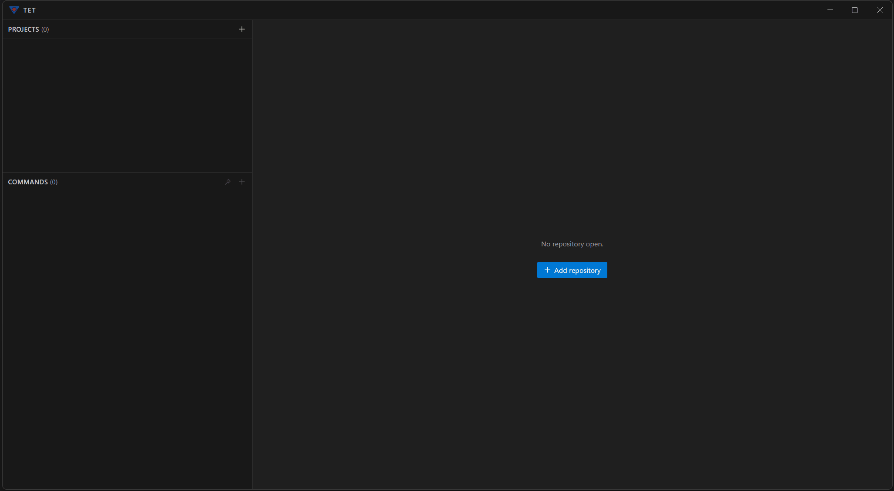

<p align="center">
  
</p>

<p align="center"><em>"Welcome home, Jack."</em></p>

<h1 align="center">TET</h1>

<p align="center">
  <strong>A desktop workspace for coding agents.</strong>
</p>

<p align="center">
  <a href="https://github.com/samil-kale/tet/releases/latest"></a>
  <a href="https://github.com/samil-kale/tet/actions/workflows/build.yml"></a>
  
  
  
</p>

<p align="center">
  <a href="https://github.com/samil-kale/tet/releases/latest"><strong>Download</strong></a> &bull;
  <a href="#get-started"><strong>Build from source</strong></a> &bull;
  <a href="CLAUDE.md"><strong>Architecture notes</strong></a>
</p>

---

<!--
  ASSETS TO ADD (drop into docs/, keep the filenames):
  - docs/split.png     a project split into panes, each with its own tab strip.
  - docs/git-pane.png  the git toggle slid out: branch tree over changed files.
  - docs/diff.png      the diff dialog over the window.
  - docs/notify.png    project rows with working / waiting / finished marks.
-->

<p align="center">
  
</p>

---

## Why

I'm a developer with more than 15 years of experience, and I have worked in IDEs that whole
time. My favourite would change every few years, and I always had a close bond with whichever
IDE I considered the best fit for me at the moment.

Bit by bit, though, I noticed that I was doing more and more of the actual work inside the
agent (Claude, opencode or Codex), and only looked at the git diff once a feature was done to
see what had changed and whether those changes matched what I wanted. That shifted the way I
work quite far from how I used to go about it. Where I once spent most of my time in the code
editor, it was now individual Claude sessions I had to click through and, of course, the
checking glance at git.

New problems came with that: which session in which project has just finished, which prompt
needs my attention, where is the git diff I'm supposed to look at now.

With TET I wanted a fresh start, one where the agents are at the centre, rounded out with the
features that are a bit awkward in a plain terminal, like drag and drop for files and images.

With TET you always know which session in which project has just finished and which one needs
attention.

TET is not a plain multiplexer that just shows several consoles side by side. The agents are
integrated and come with a carefully built notification system as well as features that make
the work easier or extend it (image and file drag and drop, for one).

And the best part: the git diff is one click away to look over and check.

---

## Features

### Real terminals, several agents

**Claude Code**, **opencode** and **Codex CLI** run as first-class terminal tabs; not a
wrapper, the actual CLI in a real pty. TET reads each agent's own session state and shows, on the
tab and on the project row, whether a turn is **working**, **stopped for an answer**, or
**finished while you were looking elsewhere**. List, resume, rename and delete past sessions from
the tab's menu. Drag files or images straight onto a terminal; ctrl-click a path in the output to
open it.

### Multiple terminals, one glance

Split a project's terminals into up to four panes; five fixed presets (single, columns,
2&times;2 &hellip;), each pane with its own tab strip. See the agent, the dev server and a shell
at once instead of cycling tabs.

<!-- <p align="center"></p> -->

### The git pane

A toggle in the tab strip slides out a pane between navigation and terminals; the branch
tree (branches, remotes, tags, stashes) over the files the agent changed; and stays out
until you press it again, so a terminal and the repository stay on screen together. Checkout,
fetch/pull/push, commit-all, discard (to the trash, not `rm`), `.gitignore` from a right-click.
Clone from GitHub or GitLab in the add-repository dialog.

<!-- <p align="center"></p> -->

### A diff dialog that's also an editor

Double-click a changed file, or ctrl-click a path in a terminal, for a full-window diff. Images
diff as images; whitespace toggles off; unfold context on demand. The same view doubles as a
plain code editor (Monaco) for a quick look-and-fix without leaving TET.

<!-- <p align="center"></p> -->

### Notifications you can act on

Desktop notifications when a turn ends or needs input, with a guard so a turn that only launched a
subagent doesn't count as done. Alongside them, an always-visible read of what's **waiting** and
what **finished out of sight**, on every project row.

<!-- <p align="center"></p> -->

### Saved commands per project

The sidebar's lower half is a project's saved shell commands, kept in a `tet.json` in the
repository root; so they travel with the repo and can be committed. Run one and it opens a
terminal tab whose process *is* the command.

### Themes

VS Code's Dark Modern palette by default, plus more themes; each agent can be told to draw in
TET's theme or left to its own.

---

## Get started

### Download

**[Grab the latest release](https://github.com/samil-kale/tet/releases/latest)** for Windows,
Linux (AppImage / `.deb`) or macOS. Windows and the AppImage update themselves on the next quit;
they never force it, since a terminal tab is a live agent session.

### Build from source

```bash
git clone https://github.com/samil-kale/tet.git
cd tet
npm install
npm start
```

Other scripts: `npm run compile`, `npm run typecheck`, `npm run lint`, `npm test`.

### Requirements

TET needs **`git`** on your `PATH`, plus **at least one supported agent**; Claude Code,
opencode or Codex CLI; or just a shell. It checks on startup and tells you exactly what's
missing.

---

## How it works

TET is Electron + React + xterm.js. Git is never reimplemented; it wraps the local `git`
CLI in its own process so typing in a terminal stays smooth. Each agent is described by one
definition and lives in its own folder; the three are treated as three separate products that
happen to share a kind of tab, because every time the same question was put to all of them, the
answers differed.

The design decisions, and the things that were built and deliberately taken back out, are written
down in **[CLAUDE.md](CLAUDE.md)**.

## Contributing

Issues and pull requests welcome. Run `npm run typecheck`, `npm run lint` and `npm test` before
opening one. On Linux the app tests need a display (`xvfb-run`).

## License

[MIT](LICENSE)
