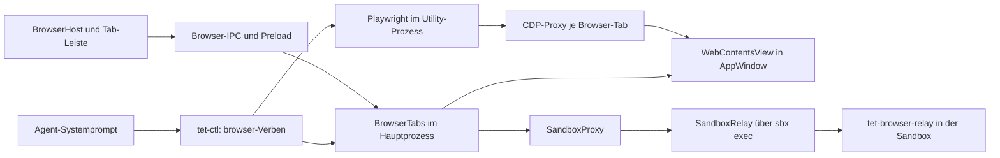

# Browser-Funktion: Fundstellen und Rückbauplan

Diese Sammlung beschreibt den Code bei `1932dad6e5f0b14e4c6103c2cc5337545dcfadfa`.
Die Einführung ist `a8af8d7`; dessen Eltern-Commit `cd20ad76bf768dae83e76552737382b89ab7a517`
ist der Stand unmittelbar davor, Version 0.18.3. Zwischen diesem Stand und HEAD liegen
32 Commits und Änderungen an 164 Dateien. Darunter sind viele unabhängige Änderungen.

Untersucht wurden die Commit-Diffs, der aktuelle Quellcode, die Aufrufer gemeinsamer
Hilfsfunktionen, Build-Konfiguration, Linter, Tests und Projektanweisungen. Die folgenden
Zeilennummern und Quellcode-Links beziehen sich auf diesen historischen Stand.
Der Rückbau ist inzwischen umgesetzt; Umfang und Prüfungen stehen in Abschnitt 13.

## 1. Zusammenhang



Zur Funktion gehören Navigation, Adressleiste, Browser-Tabs im Split-Layout, Seitenfokus,
DevTools einschließlich Docking, Weitergabe von Shortcuts, HTTP-Login, Popups, Downloads,
Berechtigungen, Zertifikate, Profile, Screenshots, Standbilder unter Überlagerungen und
die Browser-Automatisierung. In einer Sandbox kommt die vollständige Proxy-/Relay-Strecke hinzu.

## 2. Dateien, die vollständig entfallen können

Alle 17 folgenden Dateien dienen ausschließlich der Browser-Funktion. Ihre Aufrufer
stehen in den nächsten Abschnitten. Erst diese Verbindungen lösen, dann die Dateien löschen.

| Datei | Inhalt | Einführung |
| --- | --- | --- |
| [src/main/browser/browser-tabs.ts](https://github.com/samil-kale/tet/blob/1932dad6e5f0b14e4c6103c2cc5337545dcfadfa/src/main/browser/browser-tabs.ts#L1) | `BrowserTabs`, `ViewHost`, `BrowserSandbox`, `SandboxRoute`, `BrowserScope`, `BrowserPage`, `BrowserDownload`; Views, Navigation, HTTP-Abfrage für `--wait`, Fokus, Popups, Login, Permissions, lokale Zertifikate, Downloads, Profile und deren Bereinigung, Standbilder, DevTools, URL-Normalisierung, User-Agent, `handOver`, `issuedBy` | `a8af8d7`, vielfach erweitert |
| [src/main/browser/browser-client.ts](https://github.com/samil-kale/tet/blob/1932dad6e5f0b14e4c6103c2cc5337545dcfadfa/src/main/browser/browser-client.ts#L1) | `browserAutomation`, Utility-Prozess und MessageChannel zu den CDP-Proxys, `tabClosed`, `BrowserAutomation` | `a8af8d7` |
| [src/main/browser/browser-host.ts](https://github.com/samil-kale/tet/blob/1932dad6e5f0b14e4c6103c2cc5337545dcfadfa/src/main/browser/browser-host.ts#L1) | Einstieg des Browser-Utility-Prozesses, `serveModule` mit zusätzlichem Port | `a8af8d7` |
| [src/main/browser/browser-automation.ts](https://github.com/samil-kale/tet/blob/1932dad6e5f0b14e4c6103c2cc5337545dcfadfa/src/main/browser/browser-automation.ts#L1) | Playwright-Verbindung, `CdpEnvelope`, `usePort`, Accessibility-Snapshot, Klick, Eingabe, Tasten, Warten und Console | `a8af8d7` |
| [src/main/browser/cdp-proxy.ts](https://github.com/samil-kale/tet/blob/1932dad6e5f0b14e4c6103c2cc5337545dcfadfa/src/main/browser/cdp-proxy.ts#L1) | `CdpProxy`: stellt Playwright genau eine Seite als Browser bereit, Electron-Debugger und Frame-Sessions | `a8af8d7` |
| [src/main/browser/sandbox-proxy.ts](https://github.com/samil-kale/tet/blob/1932dad6e5f0b14e4c6103c2cc5337545dcfadfa/src/main/browser/sandbox-proxy.ts#L1) | `SandboxProxy`, `SandboxDialer`: lokaler HTTP-/CONNECT-Proxy zur Sandbox, Weitergabe von Verbindungsfehlern | `4651f13` |
| [src/main/sbx/sbx-relay.ts](https://github.com/samil-kale/tet/blob/1932dad6e5f0b14e4c6103c2cc5337545dcfadfa/src/main/sbx/sbx-relay.ts#L1) | `SandboxRelay`, `RelayClient`, Installation und Start des Relays per `sbx exec -i`, Streams und Lebenszyklus | `4651f13` |
| [src/cli/browser-relay.ts](https://github.com/samil-kale/tet/blob/1932dad6e5f0b14e4c6103c2cc5337545dcfadfa/src/cli/browser-relay.ts#L1) | `serveRelay`, Proxy-Auswahl, `NO_PROXY`, Loopback-Verbindungen, HTTP-Tunnel, CA-Übergabe | `4651f13` |
| [src/cli/tet-browser-relay.ts](https://github.com/samil-kale/tet/blob/1932dad6e5f0b14e4c6103c2cc5337545dcfadfa/src/cli/tet-browser-relay.ts#L1) | Eigenständiger CLI-Einstieg für das Relay | `4651f13` |
| [src/shared/browser-relay.ts](https://github.com/samil-kale/tet/blob/1932dad6e5f0b14e4c6103c2cc5337545dcfadfa/src/shared/browser-relay.ts#L1) | `RelayFrame`, `parseRelayFrame`, `lineReader`, `RelayStreams`, Framing und Backpressure | `4651f13` |
| [src/shared/loopback.ts](https://github.com/samil-kale/tet/blob/1932dad6e5f0b14e4c6103c2cc5337545dcfadfa/src/shared/loopback.ts#L1) | `isLoopbackHost`, `bareHost`; sämtliche derzeitigen Aufrufer gehören zum Browser/Relay | `e19f401` |
| [src/shared/types/browser.ts](https://github.com/samil-kale/tet/blob/1932dad6e5f0b14e4c6103c2cc5337545dcfadfa/src/shared/types/browser.ts#L1) | Alle Browser-Datentypen, `BROWSER_TAB_PREFIX`, `isBrowserTabId`, `BROWSER_DOCKS` | `a8af8d7` |
| [src/main/ctl/ctl-browser-verbs.ts](https://github.com/samil-kale/tet/blob/1932dad6e5f0b14e4c6103c2cc5337545dcfadfa/src/main/ctl/ctl-browser-verbs.ts#L1) | Alle elf Browser-Verben einschließlich `--wait`, Scope, Fehlermeldungen, `untrustedContent`, Screenshots und Download-Pfade | `a8af8d7` |
| [src/main/ipc/browser.ts](https://github.com/samil-kale/tet/blob/1932dad6e5f0b14e4c6103c2cc5337545dcfadfa/src/main/ipc/browser.ts#L1) | `registerBrowserIpc`: sämtliche Browser-Handler und Events | `a8af8d7` |
| [src/preload/page-preload.ts](https://github.com/samil-kale/tet/blob/1932dad6e5f0b14e4c6103c2cc5337545dcfadfa/src/preload/page-preload.ts#L1) | Preload fremder Seiten, Weitergabe nicht behandelter vertrauenswürdiger Shortcut-Tasten | `d3c3569` |
| [src/renderer/tabs/BrowserHost.tsx](https://github.com/samil-kale/tet/blob/1932dad6e5f0b14e4c6103c2cc5337545dcfadfa/src/renderer/tabs/BrowserHost.tsx#L1) | `BrowserHost`, `BrowserView`, Adressleiste, Seiten-/DevTools-Boxen, Standbilder und Pause-Overlay, Fokus, Menüs, `askLogin`, Docking und Größen | `a8af8d7` |
| [test/main/browser.test.ts](https://github.com/samil-kale/tet/blob/1932dad6e5f0b14e4c6103c2cc5337545dcfadfa/test/main/browser.test.ts#L1) | Browser-URL, User-Agent, CDP-Proxy, Relay/Proxy, Download-Übergabe und Zertifikate | `a8af8d7` |

## 3. Hauptprozess, Fenster und Lebenszyklus

| Datei / Stellen | Rückbau | Was erhalten bleiben muss |
| --- | --- | --- |
| [src/main/main.ts](https://github.com/samil-kale/tet/blob/1932dad6e5f0b14e4c6103c2cc5337545dcfadfa/src/main/main.ts#L22): 22–24, 39, 109–111, 124, 228–265, 277, 371–372, 465, 483, 498, 541 | Browser-/Relay-Imports, `BrowserTabs`, `browserAutomation`, `sandboxRoute`, Browser-Abhängigkeiten in `projectDeps`, Control und IPC, Start-Bereinigung, Fenster-Schließen und `browser.stop` entfernen. `log-level=3` wurde für Browser-DevTools hinzugefügt und gehört ebenfalls zur Prüfung. | Git-/Explorer-Prozesse, Control-Server, Umgebungsdialog, Notices und Shutdown der Terminals. Der Control-`notice`-Eintrag ist bislang nur für `browser-open --wait` nötig; die übrigen `notice`-Aufrufer bleiben. |
| [src/main/window.ts](https://github.com/samil-kale/tet/blob/1932dad6e5f0b14e4c6103c2cc5337545dcfadfa/src/main/window.ts#L28): 28–48, 77–84, 222–234, 244–317, übrige `page.webContents`-Zugriffe | Der Browser brachte den Wechsel von `BrowserWindow` zu `BaseWindow` plus eigener `WebContentsView`. Browser-Anbindungen sind `AppWindowDeps.onClosed`, `addView`, `removeView`, `focusPage`. Für den vollständigen Rückbau die Fensterstruktur auf ein `BrowserWindow` vereinfachen und die aktuellen `page.webContents`-Zugriffe entsprechend umstellen; dazu `main.ts`'s `BaseWindow.getAllWindows` anpassen. | Ausgabebündelung, Notices, Theme/Titlebar, Notifications, Editor-/Terminal-Abfragen, Schutz gegen Navigation, externe Links und DevTools von TET. Die spätere Renderer-Absturzbehandlung mit verzögertem Wiederaufbau (`rendererRebuildTimer`, 325–351) erhalten. Kein Zurückkopieren der ganzen alten Datei. |
| [src/main/projects.ts](https://github.com/samil-kale/tet/blob/1932dad6e5f0b14e4c6103c2cc5337545dcfadfa/src/main/projects.ts#L194): Import 11, `ProjectDeps.browserTabs` 34, `forgetWorktree` 194–197, `closeProjectRef` 202–205 | `browserTabs` aus den Abhängigkeiten, `closeAll` und `clearProfile` entfernen; den reinen Session-Cleanup von `forgetWorktree` erhalten und dessen jetzt unnötige Parameter prüfen. | Schließen von Terminals und Repository, Records, Entfernen der Agent-Sessions und korrektes Warten vor dem Löschen eines Worktrees. |
| [src/main/store/project-dirs.ts](https://github.com/samil-kale/tet/blob/1932dad6e5f0b14e4c6103c2cc5337545dcfadfa/src/main/store/project-dirs.ts#L41): 15, 21, `downloadsDir` 42–44, `sandboxDownloadsDir` 99–101 | Beide Browser-Download-Pfadfunktionen und zugehörige Beschreibung entfernen. | `dropsDir`, `sandboxDropsDir`, Session-, Handover-, Sandbox- und Worktree-Pfade. Screenshots nutzen bereits die gemeinsamen Drops. |
| [src/main/terminals/session-manager.ts](https://github.com/samil-kale/tet/blob/1932dad6e5f0b14e4c6103c2cc5337545dcfadfa/src/main/terminals/session-manager.ts#L490): Import 16, 490–495 | `BrowserSandbox` und `browserSandbox(tabId)` entfernen. | `seenPaths`, `handPaths`, Session-Auflistung, Sandbox-Start, gespeicherte Befehle und deren spätere Refactorings. |
| [src/main/terminals/tab-place.ts](https://github.com/samil-kale/tet/blob/1932dad6e5f0b14e4c6103c2cc5337545dcfadfa/src/main/terminals/tab-place.ts#L79): Import 13 und `sandboxDownloadsDir`, 82–83, 127–129, 253–255 | `TabPlace.browserSandbox` und die Implementierungen in `HostPlace`/`SandboxPlace` entfernen. | Die Einteilung, wo ein Terminal läuft, `dropsDir`, Mounts und Session-Aktionen. |
| [src/main/util/utility-client.ts](https://github.com/samil-kale/tet/blob/1932dad6e5f0b14e4c6103c2cc5337545dcfadfa/src/main/util/utility-client.ts#L31): 28–31, 69 | Den optionalen `onStart`-Callback und seine Beschreibung entfernen: sein einziger aktueller Nutzer ist `browser-client.ts`. | `utilityClient`, Request-/Response-Verarbeitung, AbortSignal, Start/Stop und Fehlerbehandlung für Git und Explorer. |
| [src/main/util/utility-host.ts](https://github.com/samil-kale/tet/blob/1932dad6e5f0b14e4c6103c2cc5337545dcfadfa/src/main/util/utility-host.ts#L65): 65–80 | Den optionalen `onPort`-Callback und die zusätzliche Port-Verzweigung entfernen: nur `browser-host.ts` nutzt sie. | `serving`, `serveModule` und die normale Behandlung der Utility-Aufrufe. |
| [src/main/util/devtools-key.ts](https://github.com/samil-kale/tet/blob/1932dad6e5f0b14e4c6103c2cc5337545dcfadfa/src/main/util/devtools-key.ts#L1) | Browser-Verweis im Kommentar entfernen. | `isDevToolsKey` wird weiterhin von TETs eigenem Fenster benötigt und kann bleiben. |

Die Fenstervereinfachung ist der größte Eingriff. Ein `BaseWindow` mit einer einzigen
`WebContentsView` könnte technisch weiter funktionieren; das wäre ein kleinerer Eingriff,
ließe aber den für das Feature eingeführten Fensterumbau bestehen. Die aktuelle
Fehlerbehandlung und Sicherheitsregeln dürfen bei einer Vereinfachung nicht verloren gehen.

## 4. API, IPC und tet-ctl

| Datei / Stellen | Rückbau |
| --- | --- |
| [src/shared/api.ts](https://github.com/samil-kale/tet/blob/1932dad6e5f0b14e4c6103c2cc5337545dcfadfa/src/shared/api.ts#L326): Browser-Typimporte 2, 4–14 und `TETApi.browser` 326–364 | Den gesamten `browser`-API-Bereich und ausschließlich dafür benötigte Imports entfernen. `TETApi.sbx.signInInBrowser` bleibt. |
| [src/shared/ipc.ts](https://github.com/samil-kale/tet/blob/1932dad6e5f0b14e4c6103c2cc5337545dcfadfa/src/shared/ipc.ts#L109): `ShortcutKey`-Import 2; 109–112, 142–152, 179–183 | Alle `browser:*`-Kanäle aus Invoke-, Send- und EventChannels entfernen. Der separate Kanal `sbx:sign-in-browser` bleibt. |
| [src/preload/preload.ts](https://github.com/samil-kale/tet/blob/1932dad6e5f0b14e4c6103c2cc5337545dcfadfa/src/preload/preload.ts#L164): 164–183 | Den gesamten `browser`-Wrapper einschließlich aller Subscriptions entfernen. |
| [src/main/ipc/deps.ts](https://github.com/samil-kale/tet/blob/1932dad6e5f0b14e4c6103c2cc5337545dcfadfa/src/main/ipc/deps.ts#L30): Import 2 und Feld 30 | `BrowserTabs`-Import und `browserTabs`-Abhängigkeit entfernen. |
| [src/main/ipc/index.ts](https://github.com/samil-kale/tet/blob/1932dad6e5f0b14e4c6103c2cc5337545dcfadfa/src/main/ipc/index.ts#L25): Import 2 und Aufruf 25 | `registerBrowserIpc` entfernen. |
| [src/shared/ctl.ts](https://github.com/samil-kale/tet/blob/1932dad6e5f0b14e4c6103c2cc5337545dcfadfa/src/shared/ctl.ts#L590): 590–693 | Den Kommentar vor der Browser-Gruppe und alle elf Einträge aus `CONTROL_VERBS` entfernen. Daraus werden CLI-Parsing, Help und `ControlVerbName` abgeleitet. |
| [src/main/ctl/ctl-verbs.ts](https://github.com/samil-kale/tet/blob/1932dad6e5f0b14e4c6103c2cc5337545dcfadfa/src/main/ctl/ctl-verbs.ts#L119): Import 22 und Registrierung 119 | Import und `...browserVerbs(deps, refFrom)` entfernen; die übrigen Handler bleiben. |
| [src/main/ctl/ctl-verb.ts](https://github.com/samil-kale/tet/blob/1932dad6e5f0b14e4c6103c2cc5337545dcfadfa/src/main/ctl/ctl-verb.ts#L187): Browser-Typimporte 21–22, `notice` 181–182, `browser` 187–192, `ControlTerminals.browserSandbox` 245–246 | Browser-Abhängigkeiten und den allein vom Browser verwendeten Control-Notice-Callback entfernen; den dann unnötigen `NoticeSeverity`-Import prüfen. |
| [src/main/ctl/caller-side.ts](https://github.com/samil-kale/tet/blob/1932dad6e5f0b14e4c6103c2cc5337545dcfadfa/src/main/ctl/caller-side.ts#L23): 23–25, 39, 56 | `CallerSide.browsesInSandbox` und dessen Host-/Sandbox-Werte entfernen. Alle übrigen Zugriffsregeln bleiben. |
| [src/shared/ctl-side.ts](https://github.com/samil-kale/tet/blob/1932dad6e5f0b14e4c6103c2cc5337545dcfadfa/src/shared/ctl-side.ts#L64): 67–71 | Aus den Sandbox-Help-Limits nur die Regeln zu Browser-Tabs entfernen. `ControlSide`, Zulassungsregeln und `promptNote` bleiben. |

Die elf Verben sind `browser-open`, `browser-list`, `browser-snapshot`, `browser-click`,
`browser-fill`, `browser-press`, `browser-wait`, `browser-screenshot`, `browser-console`,
`browser-downloads`, `browser-close`. `browser-open --wait`, `--tab`, die
Browser-Sandbox-Abgrenzung und `untrustedContent` sind in diesen Einträgen/Handlern enthalten.

[src/cli/tet-ctl.ts](https://github.com/samil-kale/tet/blob/1932dad6e5f0b14e4c6103c2cc5337545dcfadfa/src/cli/tet-ctl.ts#L1) benötigt keinen eigenen Browser-Rückbau:
es liest die gemeinsame Verb-Liste. Den generischen Parser, `--background`, Timeout-Code
und Help nicht aufgrund der Browser-Verben entfernen.

## 5. Prompts und Anweisungen

| Datei / Stellen | Rückbau / Abgrenzung |
| --- | --- |
| [src/main/agents/system-prompt.ts](https://github.com/samil-kale/tet/blob/1932dad6e5f0b14e4c6103c2cc5337545dcfadfa/src/main/agents/system-prompt.ts#L39): 39–43 und 50 | `BROWSER_SENTENCE` und `(admitsVerb(side, "browser-open") ? BROWSER_SENTENCE : "")` entfernen. Sonst verweist der Prompt auf ein nicht mehr vorhandenes Verb. |
| [src/shared/ctl-side.ts](https://github.com/samil-kale/tet/blob/1932dad6e5f0b14e4c6103c2cc5337545dcfadfa/src/shared/ctl-side.ts#L73): `ControlSide.promptNote` 28–29, Host-Wert 52, Sandbox-Text 73–79 | Die zusätzliche SBX-Erklärung kam während der Browser-Arbeit hinzu, erklärt aber Knowledge, Paths, Ports, Hosts, Secrets, Variables, Setup und Drops allgemein. Sie enthält keine Browser-Anweisung und sollte bleiben, samt `side.promptNote` im Systemprompt. |
| [AGENTS.md](https://github.com/samil-kale/tet/blob/1932dad6e5f0b14e4c6103c2cc5337545dcfadfa/AGENTS.md#L45): 45–48, 71, 116–120, 132, 137, 291, 294–301, 319–321, 427–432, 491–497 | Browser-Bereich und Relay aus der Architektur, Browser-Hosting, Profil-/Download-Regeln, Browser-Tab in der Layoutbeschreibung, Overlay-Regel, HTTP-Login-Ausnahme, Browser-Control-Regel und Browser-Sandbox-Regel entfernen bzw. den umgebenden Text anpassen. |

Der genaue zusätzlich eingeführte Prompt lautet:

> When you need a web browser, to check a web app or read a page, use tet-ctl's browser verbs rather than your own browser tools: the page opens in a tab the user sees.

Die allgemeine Prompt-Verteilung bleibt: [Claude](https://github.com/samil-kale/tet/blob/1932dad6e5f0b14e4c6103c2cc5337545dcfadfa/src/main/agents/claude/index.ts#L15)
und [pi](https://github.com/samil-kale/tet/blob/1932dad6e5f0b14e4c6103c2cc5337545dcfadfa/src/main/agents/pi/index.ts#L17) hängen `systemPrompt` an;
[Codex](https://github.com/samil-kale/tet/blob/1932dad6e5f0b14e4c6103c2cc5337545dcfadfa/src/main/agents/codex/hooks.ts#L139) erhält ihn als `SessionStart.additionalContext`.
In diesen Agent-Dateien gibt es keinen separaten Browser-Prompt, den man löschen müsste.
[src/shared/prompts.ts](https://github.com/samil-kale/tet/blob/1932dad6e5f0b14e4c6103c2cc5337545dcfadfa/src/shared/prompts.ts#L1) enthält keine Browser-Erweiterung.

Auch in AGENTS.md bleiben die Regeln zu Drops aus einem externen Browser, zu abbrechbaren
OAuth-Läufen und der Verweis auf `src/shared/shortcuts.ts` bestehen. Bereits laufende
Agent-Sitzungen haben den bisherigen Systemprompt erhalten; eine Quellcodeänderung entfernt
ihn nicht nachträglich aus ihrer bestehenden Sitzung.

## 6. Renderer, Tabs und Überlagerungen

| Datei / Stellen | Rückbau | Erhalten |
| --- | --- | --- |
| [src/renderer/App.tsx](https://github.com/samil-kale/tet/blob/1932dad6e5f0b14e4c6103c2cc5337545dcfadfa/src/renderer/App.tsx#L73): 73, 81–98 | `browserTabs` aus Feed-Ergebnis und Zusammensetzung der Tab-Leiste entfernen. | Terminal- und Editor-Tabs, Memoisierung, Pane-Layout, spätere Korrektur von `onTransitionEnd`. |
| [src/renderer/use-ref-feeds.ts](https://github.com/samil-kale/tet/blob/1932dad6e5f0b14e4c6103c2cc5337545dcfadfa/src/renderer/use-ref-feeds.ts#L31): Typimport 5; 31–32, 55–60, 72–79, 96–99, 110, 113 | Browser-State, Event-Subscription, initiales `browser.list`, Einträge beim Vergessen und Rückgabefeld entfernen. | Git-/Terminal-Feeds und `stableItems` für Terminal-Tabs. |
| [src/renderer/tabs/pane-tab.ts](https://github.com/samil-kale/tet/blob/1932dad6e5f0b14e4c6103c2cc5337545dcfadfa/src/renderer/tabs/pane-tab.ts#L1): 1–24 | `BrowserTabInfo`, `isBrowserTabId`, Browser-Alternative in `PaneTab`, `PaneTabKind`, `KindedTab` und `paneTabKind` entfernen. | Datei mit Terminal-/Editor-Modell behalten; deren Verlagerung aus `editor-tab.ts` muss nicht rückgängig gemacht werden. |
| [src/renderer/tabs/Pane.tsx](https://github.com/samil-kale/tet/blob/1932dad6e5f0b14e4c6103c2cc5337545dcfadfa/src/renderer/tabs/Pane.tsx#L213): Imports 18, 23; 214–219, 229–237, 241, 245–256, 319–329, 379, 467–470, 571–573, 588–600 | Browser-Busy-State, browserbezogenen Fokus-Callback, Erstellen/Öffnen/Schließen, Tab-Gesicht, Plus-Menü-Eintrag, Render-Zweig und Browser-Kommentare entfernen. Die Close-Gruppierung auf zwei Arten reduzieren. | Terminal-/Editor-Schließen, Rename, Handover, Marks, Sandbox-Badge der Agent-Tabs, Menüs, Split-Drag und eigener Fortschrittsbalken. |
| [src/renderer/tabs/TabArea.tsx](https://github.com/samil-kale/tet/blob/1932dad6e5f0b14e4c6103c2cc5337545dcfadfa/src/renderer/tabs/TabArea.tsx#L178): Import 11, Kommentar 124–125, 178–185, `setDragging(false)` 227 | `useFloatsOver`, ausschließlich dafür angelegtes `dragging` und dessen Setter entfernen. Browser-Kommentar beim Terminal-Dispose anpassen. | `gridRef`, `dragSource`, `dragTarget`, Snap-Zonen, Drag-End-Bereinigung, Pane-Größen und `paneTabKind` für die Terminal-Erkennung. |
| [src/renderer/ui/window-covered.ts](https://github.com/samil-kale/tet/blob/1932dad6e5f0b14e4c6103c2cc5337545dcfadfa/src/renderer/ui/window-covered.ts#L38): 38–77 und ausschließlich dafür nötiger `useSyncExternalStore`-Import | Nur `floating`, `Floating`, `useFloatsOver`, `useFloating`, leere Snapshots und zugehörige Subscription entfernen. | `covering`, `useCoversWindow`, `isWindowCovered`, `useWindowCovered`, `useTopDialog`: Dialoge beeinflussen Tab-Marks und Notifications unabhängig vom Browser. |
| [src/renderer/ui/ContextMenu.tsx](https://github.com/samil-kale/tet/blob/1932dad6e5f0b14e4c6103c2cc5337545dcfadfa/src/renderer/ui/ContextMenu.tsx#L85): Import 5 und 88–89 | Floating-Anmeldung entfernen. | Menü-Ref wird weiterhin für Messung und Positionierung gebraucht. |
| [src/renderer/ui/Notices.tsx](https://github.com/samil-kale/tet/blob/1932dad6e5f0b14e4c6103c2cc5337545dcfadfa/src/renderer/ui/Notices.tsx#L115): Import 1, Teil von 7, 118–120, `ref={stackRef}` | Nur Browser-Floating und dessen Ref entfernen. | `useTopDialog`, Portal in den obersten Dialog, Notice-State, Dismiss, Fortschritt und `report` für `notices-list`. |
| [src/renderer/ui/Sash.tsx](https://github.com/samil-kale/tet/blob/1932dad6e5f0b14e4c6103c2cc5337545dcfadfa/src/renderer/ui/Sash.tsx#L37): Import 2, 37–40 und `ref={element}` 97 | Nur das für Floating hinzugefügte Element-Ref, Hook und Kommentar entfernen. | `dragging` wird schon ohne Browser für Sash-Styling genutzt und muss bleiben, ebenso Größenänderung und Pointer-Verarbeitung. |
| [src/renderer/ui/use-window-shortcuts.ts](https://github.com/samil-kale/tet/blob/1932dad6e5f0b14e4c6103c2cc5337545dcfadfa/src/renderer/ui/use-window-shortcuts.ts#L5): 7–8, 23 und `offPage()` | Browser-Shortcut-Subscription und deren Cleanup entfernen. | DOM-Keydown-Handler vor xterm und alle bestehenden Fenster-Shortcuts. |
| [src/renderer/ui/layout-storage.ts](https://github.com/samil-kale/tet/blob/1932dad6e5f0b14e4c6103c2cc5337545dcfadfa/src/renderer/ui/layout-storage.ts#L33): 33–43 | `layoutChoice` hat nur `BrowserHost` als Nutzer und kann entfallen. | `storedChoice` wird weiterhin von `useStoredChoice` für die Lane-Auswahl verwendet; übriger Layout-Storage bleibt. |
| [src/renderer/ui/icons.tsx](https://github.com/samil-kale/tet/blob/1932dad6e5f0b14e4c6103c2cc5337545dcfadfa/src/renderer/ui/icons.tsx#L397): 397–432, Import 61 und zugehörige Lucide-Imports | `BrowserIcon`, `BackIcon`, `ForwardIcon`, `ReloadIcon`, `DevToolsIcon`, `DOCK_ICONS`, `DockIcon` und ihre ausschließlich dafür nötigen Imports entfernen. | `Globe` wird auch von `RemoteIcon` benötigt. Gemeinsame Icon-Geometrie und `ShieldIcon` erhalten. |
| [src/renderer/styles.css](https://github.com/samil-kale/tet/blob/1932dad6e5f0b14e4c6103c2cc5337545dcfadfa/src/renderer/styles.css#L1446): 1446–1451, 1472–1544 | `.browser-tab` aus gemeinsamem Selektor lösen; Browser-Kommentar sowie `.browser-tab.hidden`, `.browser-address`, `.browser-body`, `.browser-body.bottom`, `.browser-view`, `.browser-devtools`, `.browser-still`, `.browser-paused*` entfernen. | `.editor-tab`, Editor-Bar und andere gemeinsame Styles. Die späteren Änderungen an `.editor-bar`-Abständen und `.editor-path`-Rand betreffen auch Editor-Tabs und sind eine separate Designentscheidung. SEARCH-/GRAPH-/Dialog-Styles bleiben. |
| [src/renderer/ui/Dialog.tsx](https://github.com/samil-kale/tet/blob/1932dad6e5f0b14e4c6103c2cc5337545dcfadfa/src/renderer/ui/Dialog.tsx#L81): 84 | Browser-Login-Ausnahme aus dem Kommentar entfernen. | Alle allgemeinen `confirm`-/`prompt`- und Follow-up-Funktionen. |

## 7. Linter-Ausnahmen und Build

| Datei / Stellen | Rückbau |
| --- | --- |
| [eslint.config.mjs](https://github.com/samil-kale/tet/blob/1932dad6e5f0b14e4c6103c2cc5337545dcfadfa/eslint.config.mjs#L25): `IPC_SITES` 25 | `src/preload/page-preload.ts` aus den IPC-Ausnahmen entfernen; Beschreibung anpassen. |
| [eslint.config.mjs](https://github.com/samil-kale/tet/blob/1932dad6e5f0b14e4c6103c2cc5337545dcfadfa/eslint.config.mjs#L135): `SPAWN_SITES` 134–135 | Die Spawn-Ausnahme für `src/main/sbx/sbx-relay.ts` samt Kommentar entfernen. |
| [eslint.config.mjs](https://github.com/samil-kale/tet/blob/1932dad6e5f0b14e4c6103c2cc5337545dcfadfa/eslint.config.mjs#L206): `MAIN_LAYERS` 206 | `browser: []` entfernen, sobald `src/main/browser/` weg ist. |
| [eslint.config.mjs](https://github.com/samil-kale/tet/blob/1932dad6e5f0b14e4c6103c2cc5337545dcfadfa/eslint.config.mjs#L359): 359, 368–369 | `browser-automation.ts` und `browser-host.ts` aus der Konfiguration der Electron-freien Utility-Prozesse entfernen; Kommentar anpassen. Die allgemeinen Prozess-/Importgrenzen erhalten. |
| [src/main/browser/browser-tabs.ts](https://github.com/samil-kale/tet/blob/1932dad6e5f0b14e4c6103c2cc5337545dcfadfa/src/main/browser/browser-tabs.ts#L385): 385–386 | Lokales `eslint-disable-next-line no-restricted-syntax`: Rückgabe von Popup-`webContents` an Electron. Entfällt mit der Datei. |
| [src/main/browser/browser-tabs.ts](https://github.com/samil-kale/tet/blob/1932dad6e5f0b14e4c6103c2cc5337545dcfadfa/src/main/browser/browser-tabs.ts#L572): 572–573 | Lokales `eslint-disable-next-line no-restricted-syntax`: `setDevToolsWebContents(host.webContents)`. Entfällt mit der Datei. |
| [package.json](https://github.com/samil-kale/tet/blob/1932dad6e5f0b14e4c6103c2cc5337545dcfadfa/package.json#L28) und [package-lock.json](https://github.com/samil-kale/tet/blob/1932dad6e5f0b14e4c6103c2cc5337545dcfadfa/package-lock.json#L5466) | Direkte Produktionsabhängigkeit `playwright-core` entfernen und den Lockfile passend aktualisieren. `browserslist` und `baseline-browser-mapping` sind andere Abhängigkeiten. |
| [esbuild.js](https://github.com/samil-kale/tet/blob/1932dad6e5f0b14e4c6103c2cc5337545dcfadfa/esbuild.js#L39): 39–43, 50, 57–58, 68, 146, 149, 151 | Build-Einträge `hostConfig("browser", "browser")`, `cliConfig("tet-browser-relay")`, `preloadConfig("page-preload")` sowie `external: ["playwright-core"]` aus `hostConfig` entfernen; Beschreibungen bereinigen. |
| [electron-builder.yml](https://github.com/samil-kale/tet/blob/1932dad6e5f0b14e4c6103c2cc5337545dcfadfa/electron-builder.yml#L18): 18–19 | Beschreibung der Produktionsabhängigkeiten ohne Playwright. Packaging von `dist/**` und `package.json` bleibt. |

`esbuild.js`'s Variable `browser`, `platform: "browser"`, Renderer-Bundle und
Editor-Worker bezeichnen das Build-Ziel und gehören nicht zum Browser-Tab-Feature.
Die spätere Einführung von `--tests` und die CI-Änderungen in `.github/workflows/build.yml`
sind allgemein und bleiben. Ein normaler Compile entfernt alte Dateien in `dist/` nicht;
bei Umsetzung auch alte `browser-host.js`, `tet-browser-relay.js`, `page-preload.js` und
deren Source-Maps aus den erzeugten Artefakten entfernen. Der Produktionsbuild bereinigt
`dist/` bereits; Test-Builds bereinigen `dist-test/`.

## 8. Tests

| Datei / Stellen | Anpassung |
| --- | --- |
| [test/main/browser.test.ts](https://github.com/samil-kale/tet/blob/1932dad6e5f0b14e4c6103c2cc5337545dcfadfa/test/main/browser.test.ts#L1) | Vollständig entfernen; ausschließlich Browser-Funktion. |
| [test/main/ctl.test.ts](https://github.com/samil-kale/tet/blob/1932dad6e5f0b14e4c6103c2cc5337545dcfadfa/test/main/ctl.test.ts#L203): Import 14, Calls 101 und 118–119, 203–210, Terminal-Fake 259, Browser-Fakes 285–359, Dependencies 399–402 und 470–472, Reset 579 und 591–593 | Browser-Typ, Fake-Tabs, `startingRefusals`, `BROWSER_SANDBOX`, `browserSandbox`, Fake-Automation, Browser-/Notice-Dependencies und zugehöriges Calls-/Reset-Material entfernen. Allgemeine Terminal-/Sandbox-Fakes und die Records für `notices-list` erhalten. |
| [test/main/ctl.test.ts](https://github.com/samil-kale/tet/blob/1932dad6e5f0b14e4c6103c2cc5337545dcfadfa/test/main/ctl.test.ts#L980): 980 | Nur Browser-Assertion aus dem allgemeinen `--background`-Test entfernen. |
| [test/main/ctl.test.ts](https://github.com/samil-kale/tet/blob/1932dad6e5f0b14e4c6103c2cc5337545dcfadfa/test/main/ctl.test.ts#L1477): Browser-Tests 1477–1600 | Tests für Browser-Operationen, Fehler, `--wait` und Sandbox-Scope entfernen. |
| [test/main/ctl.test.ts](https://github.com/samil-kale/tet/blob/1932dad6e5f0b14e4c6103c2cc5337545dcfadfa/test/main/ctl.test.ts#L1854): 1854–1863 | SessionStart-Test erhalten, Beschreibung anpassen und die beiden `/browser verbs/`-Assertions ersetzen durch Prüfungen, dass Host- und Sandbox-Prompt keine Browser-Anweisung mehr enthalten. Environment-Abgrenzung erhalten. |
| [test/main/projects.test.ts](https://github.com/samil-kale/tet/blob/1932dad6e5f0b14e4c6103c2cc5337545dcfadfa/test/main/projects.test.ts#L95): Import 9, 95 | Browser-Typimport und Fake aus `ProjectDeps` entfernen. Sämtliche Project-/Worktree-Tests erhalten. |
| [test/e2e/app.test.ts](https://github.com/samil-kale/tet/blob/1932dad6e5f0b14e4c6103c2cc5337545dcfadfa/test/e2e/app.test.ts#L128): 128–163; Imports 4–5 | Den Browser-E2E-Test und dessen `http`-/`AddressInfo`-Imports entfernen. `fs` wird von anderen Tests benötigt. |
| [test/shared/shortcuts.test.ts](https://github.com/samil-kale/tet/blob/1932dad6e5f0b14e4c6103c2cc5337545dcfadfa/test/shared/shortcuts.test.ts#L1) | Behalten: testet allgemeine Fenster-Shortcuts, Modifier, AltGr und Tastaturlayouts. |
| [test/lint.test.ts](https://github.com/samil-kale/tet/blob/1932dad6e5f0b14e4c6103c2cc5337545dcfadfa/test/lint.test.ts#L1) | Behalten: `BrowserWindow` in den IPC-Probes meint TETs normales Fenster; keine Browser-Tab-Tests. |

Für die Umsetzung sind Typecheck, Lint, Format-Check und die verbleibende Testsuite
erforderlich. Bei der ursprünglichen Bestandsaufnahme wurden noch keine Tests ausgeführt;
die Ergebnisse des umgesetzten Rückbaus stehen in Abschnitt 13.
Die Entfernung selbst ist noch nicht auf Regressionen geprüft.

## 9. Während des Features entstandener Code, der bleiben muss

| Datei / Funktion | Grund |
| --- | --- |
| [src/shared/shortcuts.ts](https://github.com/samil-kale/tet/blob/1932dad6e5f0b14e4c6103c2cc5337545dcfadfa/src/shared/shortcuts.ts#L1), [src/renderer/shortcuts.ts](https://github.com/samil-kale/tet/blob/1932dad6e5f0b14e4c6103c2cc5337545dcfadfa/src/renderer/shortcuts.ts#L1) | Die Definitionen wurden aus dem Renderer nach `shared` verlagert. Sie werden weiterhin von Fenster, Terminal und Settings verwendet. Nur die Browser-Erklärung in `shared/shortcuts.ts`'s Kommentar bereinigen. |
| [src/shared/platform.ts](https://github.com/samil-kale/tet/blob/1932dad6e5f0b14e4c6103c2cc5337545dcfadfa/src/shared/platform.ts#L203), [src/renderer/platform.ts](https://github.com/samil-kale/tet/blob/1932dad6e5f0b14e4c6103c2cc5337545dcfadfa/src/renderer/platform.ts#L18) | Gemeinsames `isModifierHeld` bleibt Basis von Shortcuts, Links, Copy/Paste. |
| [src/renderer/identity.ts](https://github.com/samil-kale/tet/blob/1932dad6e5f0b14e4c6103c2cc5337545dcfadfa/src/renderer/identity.ts#L17): `stableItems` | Stabilisiert auch die Identität normaler Terminal-Tabs in `use-ref-feeds`. |
| [src/main/sbx/sbx-cli.ts](https://github.com/samil-kale/tet/blob/1932dad6e5f0b14e4c6103c2cc5337545dcfadfa/src/main/sbx/sbx-cli.ts#L102): `writeIntoSandbox`, [src/main/sbx/sbx.ts](https://github.com/samil-kale/tet/blob/1932dad6e5f0b14e4c6103c2cc5337545dcfadfa/src/main/sbx/sbx.ts#L152) | Wird weiterhin gebraucht, um den normalen `tet-ctl`-Launcher in eine Sandbox zu schreiben. |
| [src/main/ctl/ctl-verb.ts](https://github.com/samil-kale/tet/blob/1932dad6e5f0b14e4c6103c2cc5337545dcfadfa/src/main/ctl/ctl-verb.ts#L262): `callerTab`, `seenPath`, [src/main/ctl/ctl-worktree-verbs.ts](https://github.com/samil-kale/tet/blob/1932dad6e5f0b14e4c6103c2cc5337545dcfadfa/src/main/ctl/ctl-worktree-verbs.ts#L120) | `seenPath` verwendet `callerTab` und reicht einen konfliktbehafteten Worktree an das aufrufende Agent-Terminal weiter; kein reiner Browser-Helper. |
| [src/main/ctl/ctl-verb.ts](https://github.com/samil-kale/tet/blob/1932dad6e5f0b14e4c6103c2cc5337545dcfadfa/src/main/ctl/ctl-verb.ts#L97): `bringToFront`, `count` | Werden von normalen Tab-Verben, `tabs-output`, `tabs-wait` und weiteren Control-Aktionen verwendet. |
| [src/renderer/editor/EditorHost.tsx](https://github.com/samil-kale/tet/blob/1932dad6e5f0b14e4c6103c2cc5337545dcfadfa/src/renderer/editor/EditorHost.tsx#L50): `useEditorBusy` | Allgemeine Editor-Busy-Ermittlung; die auf `{ tabId }` reduzierte Schnittstelle kann bleiben. |
| [src/renderer/editor/editor-tab.ts](https://github.com/samil-kale/tet/blob/1932dad6e5f0b14e4c6103c2cc5337545dcfadfa/src/renderer/editor/editor-tab.ts#L49), [src/renderer/tabs/use-editor-opening.ts](https://github.com/samil-kale/tet/blob/1932dad6e5f0b14e4c6103c2cc5337545dcfadfa/src/renderer/tabs/use-editor-opening.ts#L1) | `editor-open --background` und Editor-Preview-Verhalten wurden im selben Zeitraum geändert und bleiben. |
| [src/renderer/tabs/use-project-layouts.ts](https://github.com/samil-kale/tet/blob/1932dad6e5f0b14e4c6103c2cc5337545dcfadfa/src/renderer/tabs/use-project-layouts.ts#L17), [src/renderer/tabs/pane-layout.ts](https://github.com/samil-kale/tet/blob/1932dad6e5f0b14e4c6103c2cc5337545dcfadfa/src/renderer/tabs/pane-layout.ts#L1) | Gemeinsames Tab-/Split-Modell. Den Import von `PaneTab` aus dessen neuer Datei behalten; Browser-Tabs haben keine persistierbare Session. |
| [src/main/util/path-inside.ts](https://github.com/samil-kale/tet/blob/1932dad6e5f0b14e4c6103c2cc5337545dcfadfa/src/main/util/path-inside.ts#L1), [src/main/util/shell-open.ts](https://github.com/samil-kale/tet/blob/1932dad6e5f0b14e4c6103c2cc5337545dcfadfa/src/main/util/shell-open.ts#L1) | Sichere Dateipfade, `openInside` und externe URL-/Datei-Regeln werden unabhängig vom Browser benötigt. |
| [tet.json](https://github.com/samil-kale/tet/blob/1932dad6e5f0b14e4c6103c2cc5337545dcfadfa/tet.json#L22) | Die SBX-Konfiguration wurde beim Ausprobieren ergänzt und später geändert. Sie ist Projektkonfiguration; nicht als Browser-Code zurücksetzen. |

Weitere Treffer, die kein Teil des Features sind: `sbx.signInInBrowser` und
`sbx:sign-in-browser` (OAuth im externen Browser), Projektmenü „View in browser“,
Terminal-URL-Links, Markdown-Links, allgemeine Drops aus einem Browser, Monacos
`base/browser/...`, Theme-Beschreibung von `BrowserWindow`, Browser-Erwähnungen älterer
Changelog-Einträge sowie generische Build- und npm-Paketnamen.

## 10. Daten, die nach einem Code-Rückbau noch vorhanden sein können

| Ort | Bedeutung / Umgang |
| --- | --- |
| Electron `sessionData/Partitions/tet-global` | Gemeinsames persistentes Browser-Profil der Repository-Tabs. |
| Electron `sessionData/Partitions/tet-<projectId>-<worktreeKey>` | Browser-Profil eines Worktrees. |
| Electron `sessionData/Partitions/tet-sbx-<projectId>-<repository\|worktreeKey>-<agentId>` | Profil eines Sandbox-Browsers. |
| `~/.tet/projects/<id>/downloads/` | Dateien, die Seiten heruntergeladen haben; können auch zwischenzeitliche Sandbox-Downloads enthalten. |
| `~/.tet/projects/<id>/sandboxes/<repository\|key>/<agent>/downloads/` | Fertige Sandbox-Downloads. |
| Bestehende `drops/` mit `browser.png` und weiteren nummerierten Dateien | Screenshots neben anderen Drops; den gemeinsamen Ordner erhalten. |
| Sandbox `~/.local/share/tet/browser-relay.js` | In die Sandbox geschriebener Relay-Code. Er wird nach dem Rückbau nicht mehr gestartet. |
| Renderer-localStorage `tet.layout.browser.devtools-dock`, `tet.layout.browser-devtools` | Dock-Seite und Größenanteil; bleiben als ungenutzte Werte zurück. |

Diese Daten sind nicht Voraussetzung für den Code-Rückbau. Vorhandene Downloads sind
Nutzerdaten und sollten erhalten bleiben. Keine pauschale Löschung von Electron-Profil,
`~/.tet`, Sandbox-, Session- oder Drops-Ordnern. Browser-Tabs werden nicht als eigene
Sessions persistiert; das bestehende Terminal-Layout braucht keine Browser-Migration.

## 11. Commit-Spur

Die Einordnung folgt den Diffs, auch bei unbrauchbaren Commit-Betreffzeilen.

| Commit | Relevante Änderung / Abgrenzung |
| --- | --- |
| `a8af8d7` | Einführung: Browser-Core, Playwright/CDP, Browser-Verben, API/IPC, UI, Shortcut-Verlagerung, Fensterumbau, Build, Tests, Systemprompt und AGENTS.md. |
| `0235eee` | Permissions, Fenster-Schließen, Seiten-Redirects. |
| `2462a40` | Menüs, Pause unter Notices, lokale Zertifikate, `untrustedContent`. |
| `8b06d07` | Downloads einschließlich zusätzlichem Verb, HTTP-Login, Popup-Lebenszyklus, Chromium-User-Agent, Download-Pfade. |
| `fdc4553` | Popup-/Download-Grenzen, Pflichttext für Fill, erneute Überlagerungsmessung. |
| `4651f13` | Vollständige Sandbox-Proxy-/Relay-Strecke, Sandbox-Scope, CA, Profile, Build und Test-Erweiterungen; außerdem lokale tet.json-Konfiguration. |
| `809113c` | Seiten-Bounds; zusätzlicher allgemeiner SBX-Systemprompt-Hinweis. |
| `6eed3b1` | Erste Seitenzeichnung/Background, Sash-Floating. Vorübergehende Theme-Erweiterung. |
| `e19f401` | Gemeinsame Loopback-/Sandbox-Schreib-Helfer, BrowserSandbox aus TabPlace, Tab-Arten, stabile Objektidentitäten, gemeinsame Modifier; mischt Browser und allgemeine Refactorings. |
| `d3c3569` | Browser-Views oberhalb TET, Standbilder, `page-preload`, Shortcut-Weitergabe. Entfernt die vorübergehende Theme-Erweiterung wieder. |
| `91ce4ef` | Seitenmenü im Renderer, Edit/Inspect über IPC. |
| `530badb` | Standbilder, Capture-Retry, Seite erst nach gezeichnetem Standbild ausblenden. |
| `2f3b405` | `isDevToolsKey`, `bareHost`, Tunnel-Refactoring, Adressleistenmenü. |
| `14daf40` | Eingabe der Adressleiste bei Fokusverlust erhalten, Escape/Navigations-Reset. |
| `761b346` | `browser-open --wait`, CLI-Vertrag und Tests. |
| `e8553be` | Browser-Wait-Refactoring zusammen mit unabhängigem Wechsel gespeicherter Befehle auf die Plattform-Shell und `os`-Filter. Shell-Änderungen erhalten. |
| `0de34a6` | Ruhige Wiederholungen für `--wait`, ein Notice bei Timeout. |
| `1d20735` | Server-Abfrage ohne wiederholtes Laden/Fokusübernahme; Browser-/Window-/Control-Anpassungen. |
| `bbb0669` | Gemeinsames `bringToFront`; auch `editor-open --background`. Letzteres erhalten. |
| `1012161` | Allgemeine SEARCH-/GRAPH-Felder und Styles; kein Browser-Rückbau. |
| `900e094` | DevTools-Docking, Views für DevTools, neue Browser-Typen/IPC, Icons und Layout-Choice. |
| `261dc27` | `.editor-path`-Abstand; wirkt auch außerhalb des Browsers. |
| `125529e` | Lokale SBX-Variable in tet.json; kein Browser-Code. |
| `c6e67f9` | Chromium-Log-Level wegen Browser-DevTools, daneben Icon-Anpassungen. |
| `3d467b2` | Unter anderem Relay-Fehlerbehandlung und viele allgemeine Fehler-/Git-/Control-Änderungen. |
| `03fcc5a` | Build-/Test-Schalter und CI-Verteilung; erhalten. |
| `bd64c34` | SBX-Status und Explorer; kein Browser-Rückbau. |
| `d723ede` | Allgemeine Control-Tests; erhalten. |
| `cc2ea9e` | Allgemeine Stabilitäts-/Sicherheitsänderungen, besonders verzögerter Renderer-Wiederaufbau; erhalten. |
| `aa6153f` | Breites Refactoring, auch Browser-Views/Proxy/UI und Build. Nur Browser-Anteile entfernen. |
| `4e223ea` | SBX in tet.json deaktiviert; Projektkonfiguration erhalten. |
| `1932dad` | Browser-Eintrag im Plus-Menü kleingeschrieben. |

Zum Nachvollziehen einzelner Stellen:

```powershell
git show --stat a8af8d7
git show a8af8d7 -- src/main/agents/system-prompt.ts eslint.config.mjs
git log cd20ad7..1932dad -- src/main/browser src/main/ctl/ctl-browser-verbs.ts
git diff cd20ad7..1932dad -- src/main/window.ts
```

Die Commits als Ganzes zu reverten oder alle Dateien auf `cd20ad7` zurückzusetzen würde
unabhängige Verbesserungen entfernen. Die historischen Diffs dienen als Zuordnungshilfe.

## 12. Reihenfolge und Abnahme für die Umsetzung

1. In einem zusammenhängenden Quellcode-Diff Browser-UI/Feed/Tab-Art, Shortcut-Subscription,
   Floating-Registrierungen, API/IPC, Control-Verben, Prompt und Main-/Project-/Terminal-
   Verbindungen lösen. Beim Typ-Rückbau die abhängigen Stellen gemeinsam ändern.
2. Fenster auf `BrowserWindow` vereinfachen und dabei die aktuellen Schutz- und
   Wiederherstellungsfunktionen erhalten. Den bestehenden Prozess dafür nicht beenden.
3. Die 17 reinen Dateien löschen; ausschließlich browsergenutzte Helper-Zweige,
   Icons, Styles, Kommentare, Linter-Ausnahmen und Build-Einträge entfernen.
4. Playwright-Abhängigkeit/Lockfile, Tests und AGENTS.md anpassen. Alte erzeugte
   Browser-Bundles bereinigen, ohne Nutzerdaten zu löschen.
5. `npm run typecheck`, `npm run lint`, `npm run format:check`, `npm test` ausführen.
   Kein `npm start` für einen Neustart der laufenden TET-Instanz verwenden.
6. Verbleibende Browser-Begriffe gezielt überprüfen; die in Abschnitt 9 genannten
   unabhängigen Treffer sind zulässig. Die folgenden Feature-Begriffe dürfen außerhalb
   dieser Bestandsaufnahme nicht mehr im produktiven Quellcode vorkommen.

```powershell
rg -n 'window\.tet\.browser|browser:|browser-open|browser-snapshot|tet:browser:|BrowserTabs|BrowserHost|BrowserSandbox|browsesInSandbox|playwright-core|tet-browser-relay|page-preload|untrustedContent|useFloatsOver|useFloating|layoutChoice' src test esbuild.js eslint.config.mjs package.json package-lock.json
```

Die späteren manuellen Prüfungen betreffen Fensterstart und Fokus, TET-DevTools,
Lane-Wechsel, Split/Drag/Sash, Menüs und Notices unter Dialogen, Terminal-Shortcuts,
Editor-Preview/Diff/Schließen mit ungespeicherten Änderungen, gespeicherte Befehle und
`--background`, Worktree-Cleanup sowie Sandbox-Terminals, Drops, Worktree-Handover und
SBX-Anmeldung im externen Browser. Die automatischen Tests decken die verbliebenen
Control-/Project-/Worktree-Funktionen ab; sie ersetzen diese UI-Prüfung nicht.

Ein erforderlicher Neustart der laufenden App bleibt beim Nutzer.

## 13. Umgesetzter Rückbau

Die 17 ausschließlich browserbezogenen Dateien sind gelöscht. Entfernt wurden außerdem
Browser-UI und Tab-Art, API/IPC und Preload-Anbindung, alle elf `tet-ctl`-Verben,
Prompt-Erweiterungen, Sandbox-Proxy/Relay, Downloads und Profilverwaltung im Code,
Styles, Icons, Floating-Registrierungen, Build-Ziele, Linter-Ausnahmen und
`playwright-core` aus Paket, Lockfile und lokaler Installation. Die Projektanweisungen
und die Tests sind angepasst; alte Browser-Bundles in `dist/` sind bereinigt.

Das Fenster verwendet wieder ein `BrowserWindow`. Die spätere Renderer-Fehlerbehandlung,
Terminalausgabe, Themes, externe Links, Editor-Abfragen und TET-DevTools bleiben erhalten.
Gemeinsam genutzte Hilfsfunktionen, Terminal-Drops, Worktree-Handover, Sandbox-Terminals
und SBX-Anmeldung über den externen Browser bleiben bestehen. Die nur für Screenshots
ergänzte `ControlTerminals.dropsDir`-Schnittstelle wurde entfernt; die tatsächlich für
Terminal-Drops verwendeten Methoden und Pfade bleiben bestehen.

Vorhandene Nutzerdaten unter `~/.tet`, Downloads, Chromium-Profile und Agent-Sessions
wurden beim Rückbau nicht gelöscht. Die laufende TET-Instanz wurde nicht neu gestartet.
Die historischen Links oben sind auf den ursprünglichen Commit festgelegt.

Prüfergebnisse:

- Build, `npm run typecheck`, `npm run lint`, `npm run format:check` und `git diff --check`
  sind erfolgreich. Paket und Lockfile enthalten keine Playwright-Abhängigkeit mehr;
  `npm ls --omit=dev --depth=0` zeigt allein `node-pty` als Laufzeitabhängigkeit.
- Der Gesamtlauf umfasste 570 Tests: 566 bestanden, drei wurden plattform- oder
  umgebungsbedingt übersprungen, ein vorhandener E2E-Test für gespeicherte Befehle
  schlug fehl. Dieser Test entsprach noch dem Verhalten vor `e8553be`: unquotierter
  JavaScript-Code und relative Programme liefen direkt, Shell-Verknüpfungen wurden abgelehnt.
  Er prüft jetzt die vorhandene Plattform-Shell mit korrekt quotiertem Code, explizitem
  relativem Pfad und einer portablen Befehlsverknüpfung. Das Produktverhalten blieb erhalten.
- Nach dieser Korrektur und der letzten Bereinigung der Control-Typen wurden Build sowie
  sämtliche App-E2E- und Control-Tests erneut ausgeführt: alle 130 Tests bestanden.
  Damit sind alle 567 ausgeführten Tests erfolgreich; es gibt keinen offenen Testfehler.
- Der direkte Buildstart war wegen `spawn EPERM` für esbuild blockiert. Build und Tests
  liefen erfolgreich über einen temporären TET-Shell-Tab; die laufende Nutzerinstanz
  blieb bestehen. Der Prüf-Tab und die temporären Protokolle wurden anschließend entfernt.
- Die verbleibenden Begriffe wurden geprüft: Browser-Feature-Referenzen fehlen im produktiven
  Quellcode und in der gebauten `tet-ctl`-Hilfe. Normale externe Browser-Aufrufe und Monacos
  Browser-Module bleiben erhalten. Browser-Bundles und die lokale Playwright-Installation
  sind entfernt.

Die automatischen Tests prüfen insbesondere Fensterstart, Terminalgröße und -ausgabe,
Hooks, gespeicherte Befehle, Themes und Worktree-Lebenszyklus. Die in Abschnitt 12 genannten
zusätzlichen manuellen UI- und Sandbox-Prüfungen wurden nicht vollständig durchgeführt.
